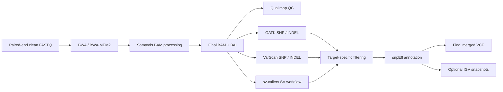

# RGA

**Resequencing Genome Analysis Toolkit**


RGA is a command-line toolkit for reproducible analysis of paired-end whole-genome resequencing data. It integrates read alignment, BAM processing and quality assessment, SNP/INDEL calling, structural-variant detection, target-sample-specific candidate filtering, functional annotation, result merging, and optional IGV batch snapshots in a single workflow.

Website: [https://rga.kefan.work/](https://rga.kefan.work/)  
Contact: [Zhe Li](mailto:lizhe@impcas.ac.cn)

> [!IMPORTANT]
> This repository distributes compiled RGA release packages, documentation, and release information. RGA source code is not published in this repository. RGA is therefore described as **binary-distributed research software**, not as open-source software.

[中文快速说明](#中文快速说明)

## Features

- Paired-end FASTQ alignment with BWA or BWA-MEM2.
- BAM processing with Samtools: fixmate, coordinate sorting, duplicate marking, final BAM generation, and indexing.
- BAM quality assessment with Qualimap.
- SNP and INDEL calling through GATK, VarScan, or both callers.
- Configurable GATK hard-filter thresholds.
- Target-sample-specific filtering based on read support and alternative-allele frequency across samples.
- Optional structural-variant analysis using the bundled sv-callers workflow.
- Functional annotation with snpEff.
- Optional IGV batch snapshots for SNPs, INDELs, and SVs.
- Resume-aware execution that skips completed stages.
- Optional cleanup of large alignment intermediates after final BAM generation.
- English interface by default, with a Chinese interface available through `-lang zn`.
- Optional email notification after analysis.

## Workflow



## Distribution Model

GitHub Releases are used to distribute the compiled Linux executable and supporting resources. A release package may contain:

- the `rga` executable;
- Conda environment definitions;
- the VarScan v2.3.9 Java package;
- an unmodified copy of the official sv-callers v1.2.2 release archive;
- deployment and workflow documentation;
- license and third-party notices.

The executable is packaged as a single file, but the external bioinformatics programs invoked by RGA must still be installed in the runtime environment.

## System Requirements

RGA is intended for 64-bit Linux servers or high-performance computing nodes. Resource requirements depend on genome size, sequencing depth, sample count, enabled callers, and the number of IGV snapshots.

The core workflow requires the following software to be available on `PATH`:

- BWA and/or BWA-MEM2;
- Samtools;
- GATK;
- Java;
- Qualimap;
- snpEff;
- Conda.

IGV screenshots additionally require IGV and Xvfb. SV analysis additionally requires Snakemake and the dependencies defined by the sv-callers workflow environment.

## Installation

Download the package for the target Linux platform from the repository's **Releases** page, extract it, and enter the release directory. The exact archive name may vary by release.

```bash
tar -xzf rga-v3.24-linux-x86_64.tar.gz
cd rga-v3.24-linux-x86_64
chmod +x rga
```

Create the main analysis environment from the environment file supplied with the same release:

```bash
conda env create -n rga -f conda-bioinfo-environment.yml
conda activate rga
```

For SV analysis, prepare the workflow environment under the name expected by RGA:

```bash
conda env create -n wf -f conda-wf-environment.yml
```

Run the environment check before the first analysis:

```bash
./rga -envcheck
```

When SV analysis will be used, include `-enable-sv` during the check:

```bash
./rga -enable-sv -envcheck
```

During environment initialization, RGA prepares the bundled VarScan Java package in the current working directory. The bundled sv-callers release is extracted only when SV detection is enabled and no custom sv-callers path is supplied.

## Input Data

Run RGA from a project directory containing `data/group_data/`. Each biological or analytical group must have its own subdirectory. Each sample must be represented by a complete pair of gzip-compressed clean FASTQ files.

```text
project/
├── rga
└── data/
    └── group_data/
        ├── group_A/
        │   ├── sample01_1.clean.fq.gz
        │   ├── sample01_2.clean.fq.gz
        │   ├── sample02_1.clean.fq.gz
        │   └── sample02_2.clean.fq.gz
        └── group_B/
            ├── sample03_1.clean.fq.gz
            └── sample03_2.clean.fq.gz
```

Required naming convention:

```text
<sample>_1.clean.fq.gz
<sample>_2.clean.fq.gz
```

RGA discovers samples from the `_1.clean.fq.gz` suffix and expects the matching R2 file in the same group directory. Use an absolute path for the reference genome and verify FASTQ integrity before analysis.

## Quick Start

Minimal GATK SNP/INDEL analysis:

```bash
./rga \
  -R /absolute/path/to/reference.fa \
  -sdn Arabidopsis_thaliana
```

Run both GATK and VarScan with BWA-MEM2 and remove alignment intermediates after final BAM generation:

```bash
./rga \
  -R /absolute/path/to/reference.fa \
  -sdn Arabidopsis_thaliana \
  -t 16 \
  -mt bwa-mem2 \
  -c both \
  -autoclear
```

Enable structural-variant detection and IGV snapshots:

```bash
./rga \
  -R /absolute/path/to/reference.fa \
  -sdn Arabidopsis_thaliana \
  -t 32 \
  -c both \
  -enable-sv \
  -enable-snp-indel-igv \
  -enable-sv-igv
```

## Language and Help

RGA uses English by default.

```bash
./rga
./rga -help
```

Use the Chinese interface with either language option:

```bash
./rga -lang zn
./rga -lang zn -help
```

RGA supports `-h` and `-help`; its own command-line options use a single leading hyphen.

## Core Options

| Option | Description | Default |
| --- | --- | --- |
| `-R`, `-ref FILE` | Absolute path to the reference-genome FASTA | required |
| `-sdn`, `-snpeffdbname STR` | snpEff database matching the reference build | required |
| `-t`, `-threads INT` | Main thread count | `16` |
| `-mt`, `-mappingtool STR` | `bwa` or `bwa-mem2` | `bwa` |
| `-c`, `-caller STR` | `gatk`, `varscan`, or `both` | `gatk` |
| `-maxf`, `-max-freq FLOAT` | Minimum ALT frequency in the target sample | `0.25` |
| `-minf`, `-min-freq FLOAT` | Maximum ALT frequency in every non-target sample | `0.10` |
| `-tr`, `-total-reads INT` | Minimum REF + ALT read count | `0` |
| `-ar`, `-alt-reads INT` | Minimum ALT-supporting read count | `1` |
| `-enable-sv` | Enable structural-variant detection | disabled |
| `-enable-snp-indel-igv` | Enable SNP/INDEL IGV snapshots | disabled |
| `-enable-sv-igv` | Enable SV IGV snapshots | disabled |
| `-autoclear` | Delete alignment intermediates after final BAM creation | disabled |
| `-send-email` | Send a completion notification | disabled |
| `-E`, `-email STR` | Notification recipient; required with `-send-email` | none |
| `-lang`, `-language STR` | Interface language: `en`, `zn`, or `zh` | `en` |
| `-ec`, `-envcheck` | Run the environment check and exit | disabled |

Use `./rga -help` for the complete GATK hard-filter and SV-filter parameter list.

## Outputs

Sample-level alignment outputs are written below the corresponding sample group:

```text
data/group_data/<group>/<sample>/<sample>_final.bam
data/group_data/<group>/<sample>/<sample>_final.bam.bai
```

Caller-specific results are stored in:

```text
data/group_data/<group>/gatk_snp_indel/
data/group_data/<group>/varscan_snp_indel/
data/group_data/<group>/sv_detection/
```

Annotated, cross-group result files are generated in the project working directory:

```text
The_Final_All.CustomFiltering.gatk.ann.<timestamp>.vcf
The_Final_All.CustomFiltering.varscan.ann.<timestamp>.vcf
The_Final_All.CustomFiltering.sv.ann.<timestamp>.vcf
```

Candidate variants are research candidates rather than automatically validated biological mutations. Review BAM quality, read support, repetitive regions, IGV evidence, and experimental validation before drawing biological conclusions.

## Resume and Cleanup

RGA detects existing stage outputs and skips completed work. For the mapping stage, the presence of both `<sample>_final.bam` and `<sample>_final.bam.bai` is sufficient to skip alignment during a rerun. This allows a later run to add IGV options without repeating completed alignment and variant-calling stages.

With `-autoclear`, RGA removes the following intermediates after the final BAM has been generated successfully:

```text
<sample>.sam
<sample>_fixmate.bam
<sample>_pos.srt.bam
<sample>_markdup.bam
```

## Documentation

- [Researcher deployment and usage guide](./RGA_研究人员部署与使用指南.md) (Chinese)
- [SNP, INDEL, and SV workflow reference](./RGA_SNP_INDEL_SV分析流程说明.md) (Chinese)
- Full command-line reference: `./rga -help`
- Project website: [https://rga.kefan.work/](https://rga.kefan.work/)

## Citation

When reporting results generated with RGA, record at least the RGA version, build date, complete command, reference-genome assembly, snpEff database version, and versions of all external callers. Until a dedicated RGA publication is available, cite the software as:

```text
Li Z. RGA: Resequencing Genome Analysis Toolkit, version 3.24.
https://rga.kefan.work/
```

Please also cite the original publications for BWA/BWA-MEM2, Samtools, GATK, VarScan, Qualimap, snpEff, IGV, sv-callers, and the SV callers used in the selected workflow.

## License

RGA-authored binary software and documentation are distributed under the [PolyForm Noncommercial License 1.0.0](./LICENSE). It permits noncommercial research and use by educational institutions, public research organizations, government institutions, and other qualifying noncommercial organizations. Commercial use requires a separate written license from the RGA copyright holder.

This is **not an OSI-approved open-source distribution**: the RGA source code is not supplied, and commercial use is restricted. Access to a public GitHub repository or release asset does not grant rights beyond those stated in `LICENSE`.

Third-party components and external programs remain subject to their own licenses. See [THIRD_PARTY_NOTICES.md](./THIRD_PARTY_NOTICES.md). The bundled sv-callers v1.2.2 archive is an unmodified upstream release redistributed under Apache License 2.0. VarScan is subject to its own noncommercial-use terms; RGA does not grant commercial VarScan rights.

## Research-Use Disclaimer

RGA is provided for research use only. It is not a medical device and is not intended for clinical diagnosis, treatment selection, or other regulated clinical decisions. The software and its outputs are provided without warranty; users are responsible for validating analyses, maintaining data security, and complying with institutional, legal, ethical, and third-party license requirements.

## Support

For reproducible bug reports, include the RGA version, operating system, command line with sensitive information removed, environment-check report, and the relevant final section of the log.

- Website: [https://rga.kefan.work/](https://rga.kefan.work/)
- Email: [lizhe@impcas.ac.cn](mailto:lizhe@impcas.ac.cn)
- Bug reports: use this repository's **Issues** page

## 中文快速说明

RGA（Resequencing Genome Analysis Toolkit）是面向双端全基因组重测序数据的Linux命令行分析工具，可完成BWA/BWA-MEM2比对、Samtools BAM处理、Qualimap质控、GATK与VarScan SNP/INDEL检测、SV检测、目标样本特异性候选变异筛选、snpEff注释和IGV批量截图。

本GitHub仓库仅用于发布编译后的RGA分发包、文档和版本信息，不提供RGA源代码。因此，本项目应表述为“仅提供二进制分发的非商业科研软件”，不应表述为开源软件。

最小运行命令：

```bash
./rga -R /绝对路径/reference.fa -sdn 对应的snpEff数据库名称
```

中文帮助：

```bash
./rga -lang zn
./rga -lang zn -help
```

输入数据必须存放在：

```text
data/group_data/<样品组>/<样品名>_1.clean.fq.gz
data/group_data/<样品组>/<样品名>_2.clean.fq.gz
```

RGA本体采用PolyForm Noncommercial License 1.0.0，仅授权非商业科研用途。商业用途需提前联系软件作者并取得书面许可。随包提供的sv-callers v1.2.2为原样打包的官方Release，适用其Apache License 2.0；VarScan及其他外部工具继续适用各自的原始协议，RGA协议不替代第三方软件协议。

详细部署、参数和结果说明请阅读[RGA研究人员部署与使用指南](./RGA_研究人员部署与使用指南.md)。
